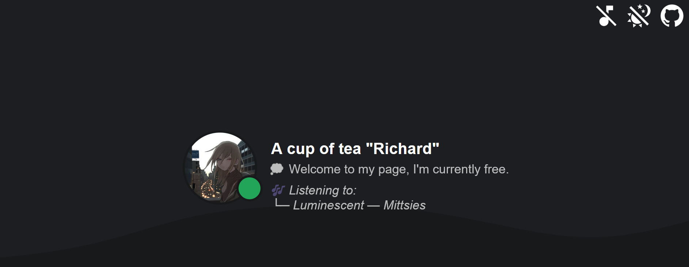

<h1 align="center">💡 Discord User Status Indicator</h1>
<h1 align="center">

</h1>
<h4 align="center">Create a simple webpage that allows people to check your Discord status quickly and easily. Whether it's your status or someone else's, this page should provide a user-friendly interface for users to see whether Discord is up and running without having to navigate to the Discord status website.<h4>

# Additional preporation 🛠️

To utilize this feature, please ensure that you have a valid Discord bot and you are on the same server as the bot.

> Attention, if you do not follow the step above, the application will not work!

# ⚙️ Setup

To start, clone the git repository and install all required dependencies:

```shell
git clone https://github.com/richardscull/WebDiscordStatus
cd WebDiscordStatus
npm install
```

Сreate and fill in the .env file with the required information:

```env
TOKEN= # Your Discord Bot Token
USERID= # Your Discord User ID
GUILDID= # Your Discord Guild ID
```

After that, you can successfully start site by typing `npm run build/start`!

###### Note: Via localtunnel you can self-host site to the global network, just use command `npm run start/web`. (Don't forget to build app first!)
